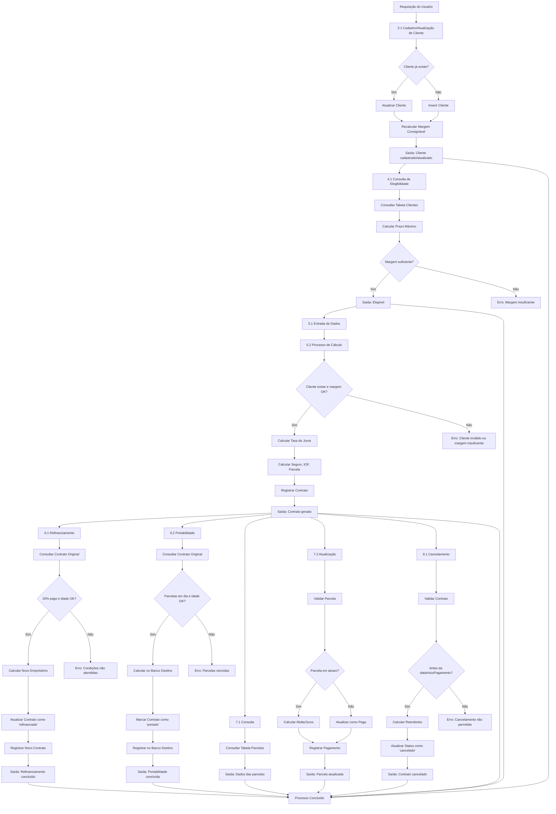

# Documentações Emprest.AI 📄
# **EMPRÉSTIMO CONSIGNADO**

## Índice
- [Autores](#autores)
- [Referências](#referencias)
- [Objetivo](#1-objetivo)
- [Visão Geral do Funcionamento](#2-visao-geral-do-funcionamento)
- [Gerenciamento de Clientes](#3-gerenciamento-de-clientes)
- [Consulta de Elegibilidade](#4-consulta-de-elegibilidade)
- [Concessão de Empréstimos](#5-concessao-de-emprestimos)
- [Refinanciamento e Portabilidade](#6-refinanciamento-e-portabilidade)
- [Consulta e Atualização de Parcelas](#7-consulta-e-atualizacao-de-parcelas)
- [Cancelamento de Contrato](#8-cancelamento-de-contrato)
- [Tabelas Sugeridas e Campos](#tabelas-sugeridas-e-campos)

## Autores
- [@Dalleth Martins](https://github.com/dalleth-martinss)
- [@Josué Davi da Costa](https://github.com/josdcosta)
- [@Carollina Guedes](https://github.com/CarollinaGuedes)
- [@Victor Augusto Ferreira](https://github.com/Victor-augusto-ferreira)


## Referências
- [Planilha de cálculo](https://docs.google.com/spreadsheets/d/1Y_vrP424Qpyh_nWdp_xtSSbsdswpp4XKPIOVeIV9B4E/edit?usp=sharing)
- Leis e Regulamentações: Lei 10.820/2003 (base para consignados), Lei 14.509/2022 (margem consignável de 35%), Regulamentação INSS, Resoluções do Banco Central, Código de Defesa do Consumidor (art. 52, §2º para multa e juros mora).

## 1. Objetivo
O Emprest.AI é um sistema backend desenvolvido para gerenciar de forma eficiente e automatizada todas as etapas relacionadas a empréstimos consignados. Isso inclui o cadastro de clientes, a análise de elegibilidade, a concessão de novos contratos (inclusive refinanciamentos e portabilidades), a consulta de status e parcelas, a atualização de pagamentos e o cancelamento de solicitações. O sistema respeita as normas brasileiras, como a margem consignável de 35% da remuneração líquida (Lei 14.509/2022), o teto de juros de 2,14% ao mês (Banco Central) e o limite de idade final de 80 anos (INSS). As taxas de juros são calculadas com base no vínculo do cliente e na idade, ajustadas dinamicamente pelo prazo escolhido, enquanto os prazos são oferecidos de 24 até 92 meses, com preferência para múltiplos de 12, mas permitindo flexibilidade até o máximo de 92 meses, desde que a idade ao fim do contrato não ultrapasse 80 anos. O seguro é opcional, e, caso o cliente não especifique a quantidade de parcelas, o sistema sugere opções viáveis dentro desse intervalo.

## 2. Visão Geral do Funcionamento
O sistema é estruturado em cinco áreas principais:

1. **Gerenciamento de Clientes:** Permite cadastrar e atualizar informações essenciais, como remuneração e margem consignável.
2. **Concessão de Empréstimos:** Processa novos empréstimos, refinanciamentos e portabilidades com cálculos automáticos.
3. **Consulta de Empréstimos:** Disponibiliza informações sobre elegibilidade, contratos ativos e parcelas.
4. **Atualização de Dados:** Registra pagamentos e ajustes em contratos existentes.
5. **Cancelamento de Contrato:** Gerencia a finalização de solicitações antes do início ou com reembolso, se aplicável.

### Regras Principais
- **Margem Consignável:** Calculada como 35% da remuneração líquida menos o valor das parcelas de outros empréstimos ativos, armazenada e obtida diretamente da tabela de clientes no banco de dados.
- **Taxas de Juros:** Determinadas pelo tipo de vínculo e idade do cliente, com um incremento específico por prazo, sempre respeitando o limite de 2,14% ao mês.
- **Prazos:** Oferecidos de 24 até 92 meses, preferencialmente em múltiplos de 12 (ex.: 24, 36, 48, 60, 72, 84), com mínimo de 24 meses e máximo de 92 meses, ajustado para que a idade do cliente ao fim do contrato não ultrapasse 80 anos.
- **Seguro:** Opcional, com custo baseado na idade e no valor do empréstimo.
- **IOF:** Incorporado ao valor financiado, conforme regulamentação fiscal.
- **Carência:** Período padrão de 30 dias entre a solicitação e o primeiro pagamento, ajustável até um máximo de 60 dias.

## 3. Gerenciamento de Clientes

### 3.1. Cadastro/Atualização de Cliente

**Requisição**

```json
{
  "idCliente": "123.456.789-00",
  "nome": "João Silva",
  "remuneracaoLiquida": 5000.00,
  "idade": 75,
  "tipoVinculo": "aposentado",
  "margemConsignavel": 950.00
}
```

**Processo**

Os dados são inseridos ou atualizados na tabela de clientes. A margem consignável (`remuneracaoLiquida * 0.35 - soma das parcelas ativas`) é recalculada automaticamente sempre que há alterações em contratos ativos (ex.: pagamento ou novo empréstimo), garantindo que o valor reflita a disponibilidade atual para novas operações.

**Saída**

```json
{
  "idCliente": "123.456.789-00",
  "nome": "João Silva",
  "remuneracaoLiquida": 5000.00,
  "idade": 75,
  "tipoVinculo": "aposentado",
  "margemConsignavel": 950.00,
  "mensagem": "Cliente cadastrado/atualizado com sucesso."
}
```

# Emprest.AI

## 4. Consulta de Elegibilidade

### 4.1. Requisição

```json
{
  "idCliente": "123.456.789-00"
}
```

### 4.2. Processo
O sistema consulta a tabela de clientes para recuperar `remuneracaoLiquida`, `margemConsignavel`, `idade` e `tipoVinculo`. O prazo máximo permitido é calculado como `(80 - idade) * 12`, limitado a 92 meses, garantindo que a idade final não exceda 80 anos. Se o cálculo resultar em mais de 92 meses, o máximo será 92; se menos, será o valor calculado. Verifica se a margem consignável é suficiente para suportar um empréstimo.

### 4.3. Saída

```json
{
  "idCliente": "123.456.789-00",
  "remuneracaoLiquida": 5000.00,
  "margemConsignavel": 950.00,
  "idade": 75,
  "tipoVinculo": "aposentado",
  "prazoMaximoPermitido": 48,
  "mensagem": "Cliente elegível para empréstimo."
}
```

## 5. Concessão de Empréstimos

### 5.1. Entrada de Dados
| Campo               | Tipo     | Descrição                                     | Exemplo         | Obrigatório? |
|---------------------|----------|-----------------------------------------------|-----------------|--------------|
| idCliente           | String   | CPF do cliente                                | "123.456.789-00"| Sim          |
| valorEmprestimo     | Decimal  | Valor solicitado                              | 10000.00        | Sim          |
| quantidadeParcelas  | Inteiro  | Número de parcelas (24 a 92 meses)            | 92              | Não          |
| dataInicioPagamento | Data     | Data do primeiro pagamento (futura, até 60 dias)| "01/04/2025"   | Não          |
| contratarSeguro     | Booleano | Opção de contratar seguro                     | true            | Sim          |

#### Dados Adicionais (Refinanciamento ou Portabilidade)
| Campo                | Tipo     | Descrição                                     | Exemplo         | Obrigatório? |
|----------------------|----------|-----------------------------------------------|-----------------|--------------|
| idEmprestimoOriginal | String   | Identificador do empréstimo existente         | "EMP-00123"     | Sim (ref/port)|
| novoValorEmprestimo  | Decimal  | Valor adicional (refinanciamento)             | 2000.00         | Não          |
| novaQuantidadeParcelas| Inteiro | Novo prazo (múltiplo de 12, ≥ 24)             | 48              | Sim (ref/port)|
| bancoDestino         | String   | Banco receptor (portabilidade)                | "BANCOXYZ"      | Sim (port)   |

## 5.2. Processo de Cálculo

### Consulta Inicial

O sistema valida o `idCliente` na tabela de clientes, obtendo `remuneracaoLiquida`, `margemConsignavel`, `idade` (atualizada na data atual), e `tipoVinculo`. Para refinanciamento ou portabilidade, consulta o `idEmprestimoOriginal` para recuperar o saldo devedor.

### Validação

- **Cliente inexistente:** "Erro: Cliente não encontrado".
- **Margem insuficiente:** "Erro: Margem consignável insuficiente (X.XX)".
- **Data inválida:** "Erro: Data de início de pagamento inválida".

#### Taxa de Juros
A taxa de juros mensal é calculada com base no tipo de vínculo, na idade e na opção de seguro, ajustada pelo prazo escolhido:

- **Fórmula:** TaxaJurosMensal = TaxaBase + 0.000357 * (QuantidadeParcelas - 24)
- **TaxaBase:** Definida por vínculo e idade (ex.: 1,6% para aposentado de 75-78 anos com seguro).
- **Incremento:** Para cada mês acima de 24, a taxa aumenta em 0,000357 (aproximadamente 0,0357%), ajustado para atingir até 0,024 no máximo em 92 meses. Exemplo: 92 meses adiciona 0,024 (2,4%) à taxa base.
- **Teto:** Limitada a 2,14% (0,0214).

#### Taxas Base por Vínculo e Idade
- **Com Seguro:** Aposentado 75-78 anos: 1,6% (0,016), máximo 48 meses.
- **Sem Seguro:** Taxa base + 0,2% (ex.: 1,8%), mesmo prazo.

### Custo do Seguro (se contratado)

**Fórmula:**
```
CustoSeguro = [0,04 + (0,001 * idade)] * ValorEmprestimo
```

**Exemplo:**
```
Idade 75, R$ 10.000 → Custo = [0,04 + (0,001 * 75)] * 10000 = 1.150,00.
```

### IOF

**Fórmula:**
```
IOF = (0,0038 * ValorEmprestimo) + (0,000082 * ValorEmprestimo * min(NúmeroDeDias, 365))
```

### Valor Total Financiado

**Inclui a carência (padrão 30 dias, máximo 60):**

```
ValorInicial = ValorEmprestimo + IOF + CustoSeguro
ValorTotalFinanciado = ValorInicial * (1 + TaxaJurosMensal / 30) ^ DiasCarencia
```

### Parcela Mensal (Método Price)

**Fórmula:**
```
Parcela = [ValorTotalFinanciado * TaxaJurosMensal] / [1 - (1 + TaxaJurosMensal)^(-QuantidadeParcelas)]
```

### Taxa Efetiva Mensal (CET)

**Resolvida numericamente para incluir todos os custos (juros, IOF, seguro):**

```
ValorEmprestimo = Parcela * [(1 - (1 + CET)^(-QuantidadeParcelas)) / CET]
```

### Validação Final

- Parcela ≤ margemConsignavel.
- Idade final (idade + prazo em anos) ≤ 80.
- quantidadeParcelas múltiplo de 12, ≥ 24.
- Dias de carência ≤ 60.
- TaxaJurosMensal ≤ 0,0214.

### Registro

Após validação bem-sucedida, o contrato é registrado no banco de dados com status "ativo", associado ao `idCliente`, para acompanhamento futuro.

## 5.3. Saídas

### Com quantidadeParcelas Informada

**Requisição**

```json
{
  "idCliente": "123.456.789-00",
  "valorEmprestimo": 10000.00,
  "quantidadeParcelas": 48,
  "dataInicioPagamento": "01/04/2025",
  "contratarSeguro": true
}
```

**Saída**

```json
{
  "idCliente": "123.456.789-00",
  "valorEmprestimo": 10000.00,
  "parcela": 350.13,
  "quantidadeParcelas": 48,
  "dataInicioPagamento": "01/04/2025",
  "dataFimContrato": "01/04/2029",
  "taxaJurosMensal": 0.0170,
  "taxaEfetivaMensal": 0.0192,
  "contratarSeguro": true,
  "custoSeguro": 1150.00,
  "iof": 157.99,
  "valorTotalFinanciado": 11496.87,
  "saldoDevedor": 11496.87,
  "totalPago": 0.00,
  "totalDevido": 16806.24,
  "margemUtilizada": 350.13,
  "margemRestante": 599.87,
  "prazoMaximoPermitido": 48
}
```

#### Sem quantidadeParcelas

##### Requisição
```json
{
  "idCliente": "123.456.789-00",
  "valorEmprestimo": 10000.00,
  "contratarSeguro": true
}
```

##### Saída
```json
{
  "idCliente": "123.456.789-00",
  "valorEmprestimo": 10000.00,
  "contratarSeguro": true,
  "opcoesParcelamento": [
    {"quantidadeParcelas": 24, "parcela": 582.45, "taxaJurosMensal": 0.0165, "valorTotalFinanciado": 11396.87, "totalDevido": 13978.80},
    {"quantidadeParcelas": 36, "parcela": 416.78, "taxaJurosMensal": 0.01675, "valorTotalFinanciado": 11446.87, "totalDevido": 15004.08},
    {"quantidadeParcelas": 48, "parcela": 350.13, "taxaJurosMensal": 0.0170, "valorTotalFinanciado": 11496.87, "totalDevido": 16806.24}
  ]
}
```

# 6. Refinanciamento e Portabilidade

Essa seção descreve os processos de refinanciamento e portabilidade de empréstimos consignados, que permitem ao cliente renegociar um contrato existente ou transferi-lo para outro banco, respectivamente. Ambos os processos utilizam o saldo devedor do contrato original como base e aplicam regras específicas para elegibilidade e cálculo.

## 6.1. Refinanciamento

O refinanciamento é uma operação que renegocia um empréstimo consignado existente no mesmo banco, possibilitando ao cliente estender o prazo, adicionar um valor extra ou ajustar as condições de pagamento. Isso geralmente é feito para reduzir a parcela mensal ou obter recursos adicionais.

### Condições
- **Pagamento Mínimo**: Pelo menos 20% das parcelas do contrato original devem estar pagas, verificado pela contagem de parcelas com status "paga" no banco de dados.
- **Idade Final**: O novo prazo (novaQuantidadeParcelas), de até 92 meses, deve garantir que a idade do cliente ao fim do contrato não exceda 80 anos.
- **Margem Consignável**: A nova parcela deve ser inferior ou igual à margem consignável disponível, obtida da tabela de clientes.

### Processo

1. **Consulta ao Contrato Original**: O sistema busca o idEmprestimoOriginal no banco de dados para obter:
   - Saldo devedor atual (saldoDevedorOriginal), calculado como o valor total financiado menos as amortizações das parcelas pagas.
   - Quantidade de parcelas pagas e restantes.
2. **Cálculo do Novo Empréstimo**:
   - O valor base é o saldoDevedorOriginal, acrescido de novoValorEmprestimo (se fornecido), mais o custo do seguro (se contratado) e o IOF.
   - A taxa de juros é recalculada com base no tipoVinculo e idade atuais do cliente, aplicando a fórmula TaxaJurosMensal = TaxaBase + 0.0025 * ((novaQuantidadeParcelas - 24) / 12), respeitando o teto de 2,14%.
   - A nova parcela é calculada pelo método Price: Parcela = [ValorTotalFinanciado * TaxaJurosMensal] / [1 - (1 + TaxaJurosMensal)^(-novaQuantidadeParcelas)].
3. **Validação**: Confirma que a parcela não excede a margem consignável e que o prazo é compatível com a idade limite.
4. **Atualização**: O contrato original é marcado como "refinanciado", e um novo contrato é gerado com os dados calculados.

### Requisição

```json
{
  "idCliente": "123.456.789-00",
  "idEmprestimoOriginal": "EMP-00123",
  "novoValorEmprestimo": 2000.00,
  "novaQuantidadeParcelas": 48,
  "dataInicioPagamento": "01/04/2025",
  "contratarSeguro": true
}
```

### Saída

```json
{
  "idCliente": "123.456.789-00",
  "idEmprestimoOriginal": "EMP-00123",
  "saldoDevedorOriginal": 8000.00,
  "novoValorEmprestimo": 2000.00,
  "parcela": 375.50,
  "novaQuantidadeParcelas": 48,
  "dataInicioPagamento": "01/04/2025",
  "dataFimContrato": "01/04/2029",
  "taxaJurosMensal": 0.0170,
  "valorTotalFinanciado": 11045.60,
  "saldoDevedor": 11045.60,
  "totalDevido": 18024.00,
  "margemUtilizada": 375.50,
  "margemRestante": 574.50
}
```

### Explicação do Exemplo

O saldo devedor original (R$ 8.000,00) é combinado com o novo valor (R$ 2.000,00), mais seguro e IOF, resultando em valorTotalFinanciado de R$ 11.045,60.  
A taxa de 1,7% (0,017) reflete a base de 1,6% (aposentado, 75 anos, com seguro) + 0,5% (incremento de 0,0025 * 2 para 48 meses).

## 6.2. Portabilidade

A portabilidade permite transferir um empréstimo consignado para outro banco, geralmente para aproveitar taxas de juros menores ou melhores condições. O saldo devedor é quitado pelo banco de destino, que assume o contrato com um novo prazo e taxa.

### Condições
- **Parcelas em Dia**: Todas as parcelas do contrato original devem estar pagas até a data atual (nenhuma com status "vencida").
- **Aceitação do Banco Destino**: O banco receptor (bancoDestino) deve aceitar a portabilidade, o que pode ser validado por integração externa ou configuração manual.
- **Idade Final**: O novo prazo (novaQuantidadeParcelas), de até 92 meses, deve respeitar o limite de idade de 80 anos no fim do contrato.
- **Margem Consignável**: A nova parcela deve caber na margem disponível.

### Processo

1. **Consulta ao Contrato Original**: O sistema busca o idEmprestimoOriginal para obter:
   - Saldo devedor atual (saldoDevedorOriginal), calculado como o valor total financiado menos as amortizações pagas.
   - Status de pagamento (confirma que está em dia).
2. **Cálculo no Banco de Destino**:
   - O valor base é o saldoDevedorOriginal, acrescido do custo do seguro (se contratado) e do IOF.
   - A taxa de juros pode ser informada pelo banco de destino ou calculada com base nas regras do sistema (TaxaBase + 0.0025 * ((novaQuantidadeParcelas - 24) / 12)), limitada a 2,14%.
   - A nova parcela é calculada pelo método Price, semelhante ao refinanciamento.
3. **Validação**: Verifica a margem consignável e o limite de idade.
4. **Transferência**: O contrato original é marcado como "portado", e o novo banco registra o contrato com os dados calculados.

### Requisição

```json
{
  "idCliente": "123.456.789-00",
  "idEmprestimoOriginal": "EMP-00123",
  "bancoDestino": "BANCOXYZ",
  "novaQuantidadeParcelas": 48,
  "dataInicioPagamento": "01/04/2025",
  "contratarSeguro": false
}
```

### Saída

```json
{
  "idCliente": "123.456.789-00",
  "idEmprestimoOriginal": "EMP-00123",
  "bancoDestino": "BANCOXYZ",
  "saldoDevedorOriginal": 8000.00,
  "parcela": 360.20,
  "novaQuantidadeParcelas": 48,
  "dataInicioPagamento": "01/04/2025",
  "dataFimContrato": "01/04/2029",
  "taxaJurosMensal": 0.0155,
  "valorTotalFinanciado": 8120.00,
  "saldoDevedor": 8120.00,
  "totalDevido": 17289.60,
  "margemUtilizada": 360.20,
  "margemRestante": 589.80,
  "statusContratoOriginal": "portado"
}
```

### Explicação do Exemplo

O saldo devedor original (R$ 8.000,00) é ajustado com IOF, resultando em valorTotalFinanciado de R$ 8.120,00 (sem seguro).  
A taxa de 1,55% (0,0155) é assumida como fornecida pelo banco destino, inferior à base padrão, justificando a portabilidade.

# Emprest.AI

## 7. Consulta e Atualização de Parcelas

### 7.1. Consulta
(Requisição e saída mantidas como na versão anterior)

### 7.2. Atualização

**Requisição**

```json
{
  "idCliente": "123.456.789-00",
  "idEmprestimo": "EMP-00123",
  "numeroParcela": 3,
  "dataPagamento": "15/07/2025",
  "valorPago": 300.00
}
```

**Processo**

- **Validação:** Confirma a existência de `idCliente`, `idEmprestimo` e `numeroParcela`. Verifica se a parcela não está paga, a menos que seja refinanciamento/portabilidade.
- **Cálculo de Atraso:** Se `dataPagamento` > `dataVencimento`:
  - **Multa:** `valorParcelaOriginal * 0.02`.
  - **Juros de mora:** `valorParcelaOriginal * 0.000333 * diasAtraso`.
  - **Valor total devido:** `valorParcelaOriginal + Multa + JurosMora`.
- **Atualização:**
  - **Pagamento total:** Atualiza `dataPagamento`, `valorPago`, `multaAtraso`, `jurosMora` e status para "paga".
  - **Pagamento parcial (se configurado):** Registra o `valorPago`, calcula o `saldoDevedorParcela` (total devido - valor pago) e ajusta o saldoDevedor total do contrato proporcionalmente, mantendo status "parcialmente paga".
  - **Impacto no Contrato:** O saldoDevedor do contrato é reduzido pelo valor amortizado (parcela - juros), refletido na próxima consulta.

**Saída (Pagamento Parcial)**

```json
{
  "idCliente": "123.456.789-00",
  "idEmprestimo": "EMP-00123",
  "numeroParcela": 3,
  "dataVencimento": "01/07/2025",
  "dataPagamento": "15/07/2025",
  "valorParcelaOriginal": 350.13,
  "multaAtraso": 7.00,
  "jurosMora": 1.63,
  "valorTotalDevido": 358.76,
  "valorPago": 300.00,
  "saldoDevedorParcela": 58.76,
  "status": "parcialmente paga",
  "mensagem": "Parcela 3 parcialmente paga. Saldo restante: 58.76."
}
```

## 8. Cancelamento de Contrato

### 8.1. Condições

- **Antes do Início:** Solicitação deve ocorrer antes da `dataInicioPagamento`, sem parcelas pagas.
- **Reembolso:** Se o valor foi liberado antecipadamente, exige devolução com juros proporcionais ao período entre liberação e cancelamento.

### 8.2. Processo

- **Validação:** Confirma que o contrato existe, está ativo e não tem parcelas pagas.
- **Cálculo de Reembolso (se aplicável):** `ValorReembolso = ValorEmprestimo * (1 + TaxaJurosMensal / 30) ^ DiasDesdeLiberacao`.
- **Atualização:** Altera o `statusContrato` para "cancelado" no banco de dados.

### 8.3. Requisição

```json
{
  "idCliente": "123.456.789-00",
  "idEmprestimo": "EMP-00123"
}
```

### 8.4. Saída (Com Reembolso)

```json
{
  "idCliente": "123.456.789-00",
  "idEmprestimo": "EMP-00123",
  "statusContrato": "cancelado",
  "valorReembolso": 10033.25,
  "mensagem": "Contrato EMP-00123 cancelado. Reembolso devido: 10033.25 (juros proporcionais inclusos)."
}
```

## Observações
- A margem consignável é mantida atualizada na tabela de clientes, refletindo o impacto de contratos ativos.
- O incremento de 0,0025 na taxa de juros por cada 12 meses adicionais acima de 24 reflete o risco associado a prazos mais longos, sempre limitado a 2,14%.
- Todas as operações podem gerar logs para auditoria, dependendo da implementação do banco de dados.

# Tabelas Sugeridas e Campos  (Sem análise ainda de DER)

## 1. Tabela: Clientes
Responsável pelo gerenciamento de dados dos clientes, incluindo informações pessoais e financeiras.

| Campo             | Tipo          | Descrição                                | Exemplo            | Chave?    |
|-------------------|---------------|------------------------------------------|--------------------|-----------|
| idCliente         | VARCHAR(14)   | CPF do cliente                           | "123.456.789-00"   | Primária  |
| nome              | VARCHAR(100)  | Nome completo                            | "João Silva"       | -         |
| remuneracaoLiquida| DECIMAL(10,2) | Renda líquida mensal                     | 5000.00            | -         |
| idade             | INT           | Idade atual do cliente                   | 75                 | -         |
| tipoVinculo       | VARCHAR(20)   | Tipo de vínculo (ex.: "aposentado")      | "aposentado"       | -         |
| margemConsignavel | DECIMAL(10,2) | Margem disponível para novos empréstimos | 950.00             | -         |
| dataAtualizacao   | DATE          | Data da última atualização dos dados     | "2025-02-24"       | -         |

### Notas:
- **margemConsignavel** deve ser recalculada automaticamente sempre que houver alteração em empréstimos ativos (inclusão, pagamento ou cancelamento).
- **idade** pode ser derivada de uma data de nascimento (campo opcional a adicionar, como **dataNascimento**), mas como a documentação usa idade diretamente, mantive assim.

## 2. Tabela: Emprestimos
Armazena informações sobre cada contrato de empréstimo (novo, refinanciamento ou portabilidade).

| Campo                | Tipo         | Descrição                                            | Exemplo          | Chave?     |
|----------------------|--------------|------------------------------------------------------|------------------|------------|
| idEmprestimo         | VARCHAR(20)  | Identificador único do empréstimo                    | "EMP-00123"      | Primária   |
| idCliente            | VARCHAR(14)  | CPF do cliente                                       | "123.456.789-00" | Estrangeira|
| valorEmprestimo      | DECIMAL(12,2)| Valor solicitado                                     | 10000.00         | -          |
| valorTotalFinanciado | DECIMAL(12,2)| Valor total com taxas (IOF, seguro, etc.)            | 11496.87         | -          |
| quantidadeParcelas   | INT          | Número de parcelas                                   | 48               | -          |
| taxaJurosMensal      | DECIMAL(6,5) | Taxa de juros mensal aplicada                        | 0.0170           | -          |
| taxaEfetivaMensal    | DECIMAL(6,5) | Custo efetivo total (CET)                            | 0.0192           | -          |
| contratarSeguro      | BOOLEAN      | Indicador de seguro contratado                       | true             | -          |
| custoSeguro          | DECIMAL(10,2)| Custo do seguro (se aplicável)                       | 1150.00          | -          |
| iof                  | DECIMAL(10,2)| Valor do IOF                                         | 157.99           | -          |
| dataSolicitacao      | DATE         | Data da solicitação                                  | "2025-02-24"     | -          |
| dataInicioPagamento  | DATE         | Data do primeiro pagamento                           | "2025-04-01"     | -          |
| dataFimContrato      | DATE         | Data prevista para o fim do contrato                 | "2029-04-01"     | -          |
| saldoDevedor         | DECIMAL(12,2)| Saldo restante a pagar                               | 11496.87         | -          |
| totalPago            | DECIMAL(12,2)| Total já pago                                        | 0.00             | -          |
| totalDevido          | DECIMAL(12,2)| Valor total a ser pago (parcela * n)                 | 16806.24         | -          |
| margemUtilizada      | DECIMAL(10,2)| Margem consumida por este empréstimo                 | 350.13           | -          |
| statusContrato       | VARCHAR(20)  | Status (ativo, cancelado, portado, etc.)             | "ativo"          | -          |
| idEmprestimoOriginal | VARCHAR(20)  | ID do empréstimo original (ref/port)                 | "EMP-00099"      | Estrangeira (opcional) |
| bancoDestino         | VARCHAR(50)  | Banco receptor (portabilidade)                       | "BANCOXYZ"       | - (opcional) |

### Notas:
- **idEmprestimoOriginal** é necessário para refinanciamentos e portabilidades, referenciando outro registro nesta mesma tabela.
- **margemUtilizada** reflete o valor da parcela mensal e deve atualizar a **margemConsignavel** na tabela Clientes.
- **statusContrato** suporta os estados "ativo", "cancelado", "portado", etc., conforme descrito.

## 3. Tabela: Parcelas
Registra as parcelas de cada empréstimo, incluindo pagamentos e atrasos.

| Campo                | Tipo         | Descrição                                        | Exemplo          | Chave?     |
|----------------------|--------------|--------------------------------------------------|------------------|------------|
| idParcela            | VARCHAR(25)  | Identificador único da parcela                   | "PAR-00123-01"   | Primária   |
| idEmprestimo         | VARCHAR(20)  | ID do empréstimo relacionado                     | "EMP-00123"      | Estrangeira|
| numeroParcela        | INT          | Número da parcela no contrato                    | 1                | -          |
| dataVencimento       | DATE         | Data de vencimento da parcela                    | "2025-05-01"     | -          |
| dataPagamento        | DATE         | Data do pagamento (se pago)                      | "2025-04-30"     | -          |
| valorParcelaOriginal | DECIMAL(10,2)| Valor original da parcela                        | 350.13           | -          |
| multaAtraso          | DECIMAL(10,2)| Multa por atraso (se aplicável)                  | 7.00             | -          |
| jurosMora            | DECIMAL(10,2)| Juros de mora por atraso                         | 1.63             | -          |
| valorPago            | DECIMAL(10,2)| Valor efetivamente pago                          | 350.13           | -          |
| saldoDevedorParcela  | DECIMAL(10,2)| Saldo restante da parcela (se parcial)           | 0.00             | -          |
| status               | VARCHAR(20)  | Status (paga, a vencer, parcialmente paga)       | "paga"           | -          |

### Notas:
- **idParcela** pode ser composto (ex.: **idEmprestimo** + **numeroParcela**) ou um identificador único.
- Campos como **multaAtraso** e **jurosMora** permitem lidar com atrasos, conforme exemplo na atualização de parcelas.

## 4. Tabela: TaxasBase (Opcional)
Armazena as taxas base por vínculo e faixa etária para cálculos dinâmicos.

| Campo                | Tipo         | Descrição                                        | Exemplo          | Chave?     |
|----------------------|--------------|--------------------------------------------------|------------------|------------|
| tipoVinculo          | VARCHAR(20)  | Tipo de vínculo                                  | "aposentado"     | Primária (composta) |
| idadeMin             | INT          | Faixa de idade mínima                            | 75               | Primária (composta) |
| idadeMax             | INT          | Faixa de idade máxima                            | 78               | Primária (composta) |
| taxaBaseComSeguro    | DECIMAL(6,5) | Taxa base com seguro                             | 0.016            | -          |
| taxaBaseSemSeguro    | DECIMAL(6,5) | Taxa base sem seguro                             | 0.018            | -          |
| prazoMaximo          | INT          | Prazo máximo em meses                            | 48               | -          |

### Notas:
- Essa tabela é opcional, mas facilita a manutenção das taxas base e prazos máximos mencionados na documentação (ex.: aposentado 75-78 anos, taxa 1,6%, prazo 48 meses).
- Pode ser substituída por lógica no código, mas um banco de dados relacional oferece maior flexibilidade.

## 5. Tabela: Logs (Opcional)
Para auditoria de operações, como sugerido nas observações.

| Campo                | Tipo         | Descrição                                        | Exemplo          | Chave?     |
|----------------------|--------------|--------------------------------------------------|------------------|------------|
| idLog                | BIGINT       | Identificador único do log                       | 1                | Primária   |
| idCliente            | VARCHAR(14)  | CPF do cliente                                   | "123.456.789-00" | -          |
| idEmprestimo         | VARCHAR(20)  | ID do empréstimo (se aplicável)                  | "EMP-00123"      | -          |
| operacao             | VARCHAR(50)  | Tipo de operação (cadastro, pagamento, etc.)     | "concessao"      | -          |
| dataOperacao         | DATETIME     | Data e hora da operação                          | "2025-02-24 10:00"| -          |
| detalhes             | TEXT         | Informações adicionais                           | "Empréstimo concedido" | -          |


# Fluxograma Completo

```mermaid
erDiagram
    CLIENTES ||--o{ EMPRESTIMOS : "possui"
    EMPRESTIMOS ||--o{ PARCELAS : "contém"
    EMPRESTIMOS ||--o| EMPRESTIMOS : "refinancia/porta"
    CLIENTES ||--o{ LOGS : "registra"
    EMPRESTIMOS ||--o{ LOGS : "registra"
    CLIENTES }o--o| TAXASBASE : "usa"

    CLIENTES {
        VARCHAR(14) idCliente PK
        VARCHAR(100) nome
        DECIMAL(10,2) remuneracaoLiquida
        DATE dataNascimento
        VARCHAR(20) tipoVinculo
        DECIMAL(10,2) margemConsignavel
        DATE dataAtualizacao
    }

    EMPRESTIMOS {
        VARCHAR(20) idEmprestimo PK
        VARCHAR(14) idCliente FK
        DECIMAL(12,2) valorEmprestimo
        DECIMAL(12,2) valorTotalFinanciado
        INT quantidadeParcelas
        DECIMAL(6,5) taxaJurosMensal
        DECIMAL(6,5) taxaEfetivaMensal
        BOOLEAN contratarSeguro
        DECIMAL(10,2) custoSeguro
        DECIMAL(10,2) iof
        DATE dataSolicitacao
        DATE dataInicioPagamento
        DATE dataFimContrato
        DECIMAL(12,2) saldoDevedor
        DECIMAL(12,2) totalPago
        DECIMAL(12,2) totalDevido
        DECIMAL(10,2) margemUtilizada
        VARCHAR(20) statusContrato
        VARCHAR(20) idEmprestimoOriginal FK "opcional"
        VARCHAR(50) bancoDestino "opcional"
    }

    PARCELAS {
        VARCHAR(25) idParcela PK
        VARCHAR(20) idEmprestimo FK
        INT numeroParcela
        DATE dataVencimento
        DATE dataPagamento
        DECIMAL(10,2) valorParcelaOriginal
        DECIMAL(10,2) multaAtraso
        DECIMAL(10,2) jurosMora
        DECIMAL(10,2) valorPago
        DECIMAL(10,2) saldoDevedorParcela
        VARCHAR(20) status
    }

    TAXASBASE {
        VARCHAR(20) tipoVinculo PK
        INT idadeMin PK
        INT idadeMax PK
        DECIMAL(6,5) taxaBaseComSeguro
        DECIMAL(6,5) taxaBaseSemSeguro
        INT prazoMaximo
    }

    LOGS {
        BIGINT idLog PK
        VARCHAR(14) idCliente FK "opcional"
        VARCHAR(20) idEmprestimo FK "opcional"
        VARCHAR(50) operacao
        DATETIME dataOperacao
        TEXT detalhes
    }
